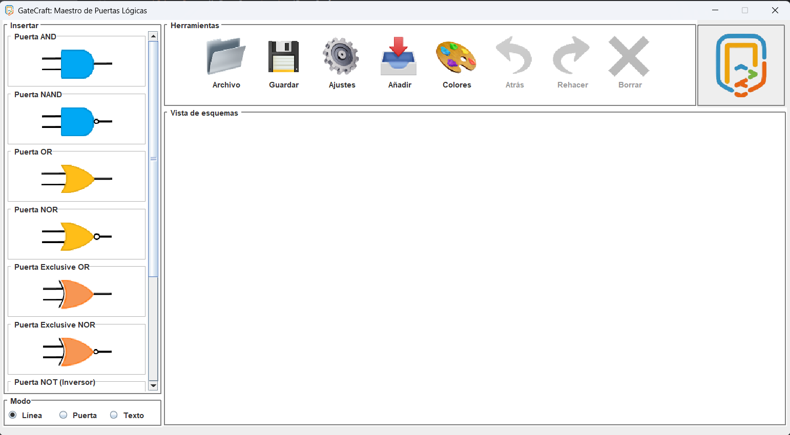
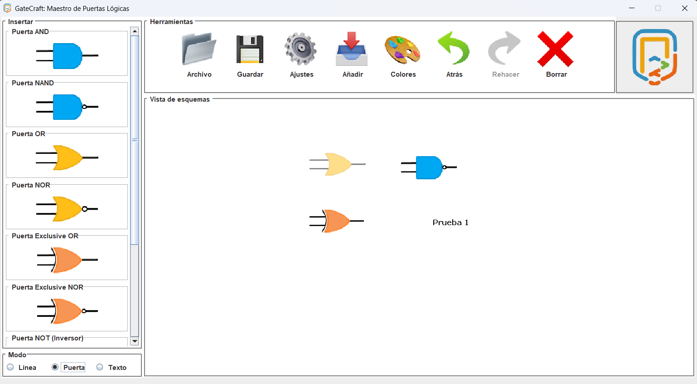

# Gatecraft-Legacy
One of my first projects on Java, focused on learning about the usage of logical gates and basic electronics.

# Features
This is the first version of GateCraft: Logical gates master. It has some features such as a java default gui to develop logical circuits, saving projects, import projects and run the circuits as a preview.

# Preview images
<figure>
  

    
  

  <figcaption style="text-align:center;">
    Java default GUI for developing your skills in logical circuits.
  </figcaption>
     
  

    
  

  <figcaption style="text-align:center;">
    Design with some gates such as OR, XOR, etc.
  </figcaption>
</figure>

# Used Technologies
Java Swing, Java.
